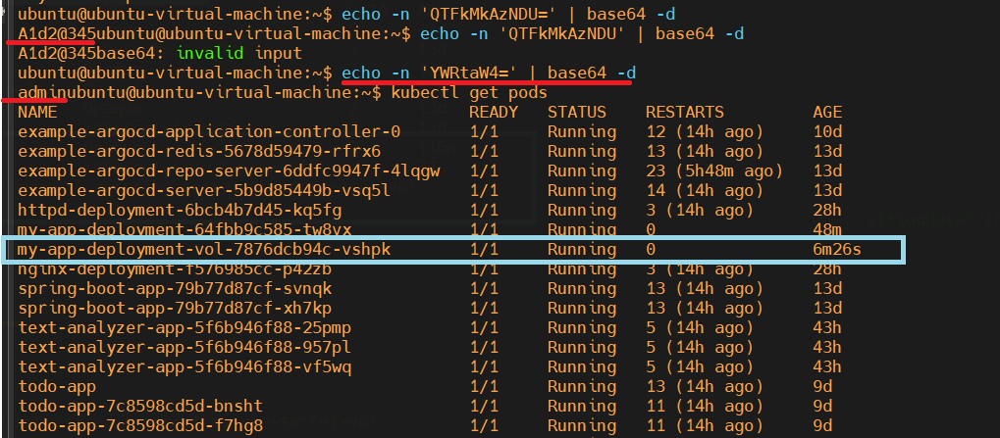

# Kubernetes: ConfigMap & Secret Implementation  
_Using as Environment Variables and Volume Mounts_

---

## ConfigMap

### What is a ConfigMap?
A **ConfigMap** is a Kubernetes object used to store non-sensitive key-value pairs (such as config options, settings, flags, or environment-specific data). These can be consumed by your application in different ways.

- **Reference Docs:** [Kubernetes ConfigMap](https://kubernetes.io/docs/concepts/configuration/configmap/)

#### Ways to Use ConfigMap in a Pod
1. Inside a container’s command and args
2. As environment variables for a container
3. As files in a read-only volume, for the application to read
4. By code inside the Pod that reads the ConfigMap via Kubernetes API

---

### Using ConfigMap as Environment Variables

#### Why Use as Environment Variables?
- Keeps your app portable and configurable across environments
- Keeps config outside the container image
- Enables easy config updates without rebuilding your Docker image

#### Example

**Command Line:**  
```sh
kubectl create configmap app-config --from-literal=LOG_LEVEL=debug --from-literal=PORT=8080
```

**YAML Format:**
```yaml
apiVersion: v1
kind: ConfigMap
metadata:
  name: app-config
data:
  LOG_LEVEL: debug
  PORT: "8080"
```

#### Behavior & Considerations

| Aspect              | Behavior                                                                                       |
|---------------------|-----------------------------------------------------------------------------------------------|
| **Non-existent keys**| If a key doesn't exist in the ConfigMap, the Pod **won’t start** (with `env`, not `envFrom`) |
| **Immutable option**| You can make a ConfigMap **immutable** (`immutable: true`)                                    |
| **Validation**      | No type validation — all values are treated as plain strings                                  |

> **Q:** What does “No type validation — all values are plain strings” mean?  
> **A:** Kubernetes does not enforce or interpret the data types of ConfigMap values. Everything is treated as a string.

#### When to Use `env` vs `envFrom`?

| Situation                                   | Recommended |
|---------------------------------------------|-------------|
| Want all config key-values as-is            | `envFrom`   |
| Want to select only certain keys            | `env`       |
| Want to rename config keys                  | `env`       |
| Want to mix ConfigMap, Secret, and literals | `env`       |
| Want simplicity and have a flat config      | `envFrom`   |

- Use `envFrom` for simple injection of all values.
- Use `env` for more control (select keys, rename, mix with secrets).
- Do not store sensitive info in ConfigMaps—use Secrets for those.

---

### Using ConfigMap as a Volume

- **ConfigMaps** can be mounted as volumes into Pods.

**Use Cases:**
- Need to inject entire config files
- The application expects a file rather than environment variables
- Want dynamic config without rebuilding the container

**Example:**  
ConfigMap YAML (e.g., `my-config-1.yaml`) is mounted to `/etc/foo` in the container.  
Each key in the ConfigMap becomes a file in that directory.

- `/etc/foo/db-port`
- `/etc/foo/db-url`
- The content of each file is the value of the key.
- Changes to the ConfigMap are reflected inside the pod/container without a restart (but you must update the ConfigMap in Kubernetes using `kubectl apply -f <path-2-configmap-file>`).

---

### Outcomes: ConfigMap

_Screenshots (for reference):_
- 
- 
- 
- 
- 
- 
- 
- 
- 
- 

---

## Secret

### What is a Secret?
A **Secret** is a Kubernetes object that contains a small amount of sensitive data such as a password, token, or key. It’s designed for sensitive information that you don’t want in plain ConfigMaps.

- **Reference Docs:** [Kubernetes Secret](https://kubernetes.io/docs/concepts/configuration/secret/)

---

#### Order of Resource Creation

While not strictly enforced, it’s common to create resources in this order:

1. **Secrets / ConfigMaps**
2. **Services**
3. **Deployments / StatefulSets / Pods**
4. **Ingress**
5. ...and more

_Reference: [Helm Install Order](https://stackoverflow.com/questions/51957676/helm-install-in-certain-order)_

---

### Types of Secrets in Kubernetes

| Secret Type                           | Purpose                                   | Use Case                                  |
|---------------------------------------|-------------------------------------------|-------------------------------------------|
| `Opaque`                              | General key-value data                    | App config (e.g., DB credentials)         |
| `kubernetes.io/dockerconfigjson`      | Docker image pull credentials             | Used in `imagePullSecrets`                |
| `kubernetes.io/tls`                   | TLS certificates                          | Requires `tls.crt` and `tls.key` keys     |
| `bootstrap.kubernetes.io/token`       | Cluster bootstrapping tokens              | Used by kubeadm                           |
| `kubernetes.io/basic-auth`            | Basic auth (`username` & `password`)      | Rarely used in modern apps                |
| `kubernetes.io/ssh-auth`              | SSH keys                                  | Git access or SSH-based apps              |
| `kubernetes.io/service-account-token` | Mounted automatically into pods           | Used by service accounts (not manual use) |

---

### Outcomes: Secret

_Screenshots (for reference):_
- 
- 
- 
- 
- 
- 
- 
- 
- 

---

## Commands Used for Deploying ConfigMap and Secret

```sh
kubectl apply -f deployment-1.yaml
kubectl apply -f service-1.yaml
kubectl apply -f configmap-1.yaml
kubectl get svc
kubectl get deploy
kubectl get cm       
kubectl describe cm my-config-1
kubectl edit cm my-config-1
kubectl get pods -o wide | grep my-app-deployment-1
curl -ivv 192.168.49.2:30003
kubectl exec -it my-app-deployment-1-85d9857f5d-q2vz7 -- /bin/sh

kubectl apply -f /Practice-Kubernetes/secret-deployment-env.yaml
kubectl get deploy
kubectl get secret
kubectl describe secret my-app-secret
kubectl edit secret my-app-secret
kubectl logs my-app-deployment-64fbb9c585-tw8vx
kubectl describe pod  my-app-deployment-64fbb9c585-tw8vx
echo -n 'YWRtaW4=' | base64 -d # Output: admin
echo -n 'QTFkMkAzNDU=' | base64 -d # Output: A1d2@345
kubectl exec -it my-app-deployment-64fbb9c585-tw8vx -- /bin/sh
history | tail -n 40
```

---

**Tip:**  
- Use **ConfigMaps** for non-sensitive config.
- Use **Secrets** for sensitive information (passwords, API keys, etc).

---