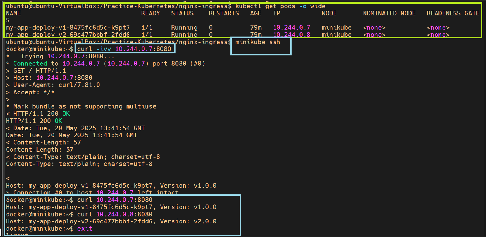

Canary deployment using the nginx-ingress controller
====================================================

> In the following example, we shift traffic between 2 applications using the
[canary annotations of the Nginx ingress
controller](https://kubernetes.github.io/ingress-nginx/user-guide/nginx-configuration/annotations/#canary).

## Steps to follow

1. version 1 is serving traffic
1. deploy version 2
1. create a new "canary" ingress with traffic splitting enabled
1. wait enought time to confirm that version 2 is stable and not throwing
   unexpected errors
1. delete the canary ingress
1. point the main application ingress to send traffic to version 2
1. shutdown version 1

## In practice

```bash
# Deploy the ingress-nginx controller for minikube
# Ref Docs : https://kubernetes.io/docs/tasks/access-application-cluster/ingress-minikube/
$ minikube addons enable ingress

# Deploy version 1 and expose the service via an ingress
$ kubectl apply -f ./app-v1.yaml -f ./ingress-v1.yaml

# Deploy version 2
$ kubectl apply -f ./app-v2.yaml

# In a different terminal you can check that requests are responding with version 1
# NOTE:In the below command url i.e. http://192.168.49.2:31690 points to ingress-nginx-controller service which get deployed under ingress-nginx namespace.
# Run command i.e. minikube service list to get url information after deplying nginx ingress controller.
$  while sleep 0.1; do curl "http://192.168.49.2:31690" -H "Host: my-app.com"; done

# Create a canary ingress in order to split traffic: 90% to v1, 10% to v2
$ kubectl apply -f ./ingress-v2-canary.yaml

# Now you should see that the traffic is being splitted

# When you are happy, delete the canary ingress
$ kubectl delete -f ./ingress-v2-canary.yaml

# Then finish the rollout, set 100% traffic to version 2
$ kubectl apply -f ./ingress-v2.yaml
```

### Cleanup

```bash
$ kubectl delete all -l app=my-app
```

#### Source git repository for refrence w.r.t k8s-deployment-stratergies
  - https://github.com/ContainerSolutions/k8s-deployment-strategies/tree/master

**Outcomes of Canary-deployment**

- 
- 
- 
- 
- 
- 
- 
- 
- 
-            