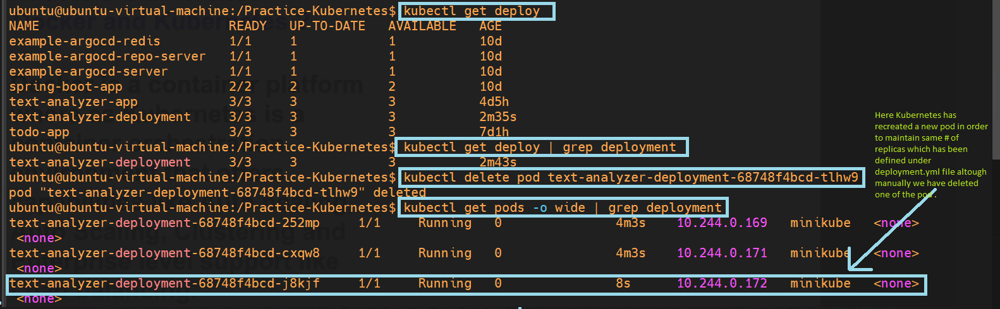
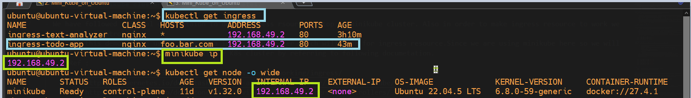

## Deploying minikube cluster for learning kubernetes.

**Installation**

- We have followed the following links to install minikube along with that we have done installation of kubectl utility by referring the following links.
    - Here I'm using Ubuntu as my base on OS on top of which We will install minikube as well as kubectl utility.Along with that we have installed docker driver which minikube will use behind the scene since KVM2 - VM-based was not working for me.

        - https://minikube.sigs.k8s.io/docs/start/?arch=%2Flinux%2Fx86-64%2Fstable%2Fbinary+download
        - https://minikube.sigs.k8s.io/docs/drivers/
        - https://kubernetes.io/docs/tasks/tools/install-kubectl-linux/ 

**Deploying pod using YAML file.**

- We have followed official documentaion to deploy pod in top of minikube cluster.
    - Ref : https://kubernetes.io/docs/concepts/workloads/pods/ 

        - First of all I have pulled one of the docker image from docker hub containing my python application onto ubuntu VM.
        - Then under pod.yaml I have updated pod name, container name to `text-analyzer-practice` and image name to `image: khannashiv/text-analyzer:46` which is present locally on my VM.
        - After updating the pod.yaml via vim editor then we have proceed with `kubectl apply -f pod.yaml` which actually has deployed the pod for us.
        - Once an IP was assigned to pod, we can go ahead & access this pod holding the required application within minikube cluster.
        - For this we have to login to minikube cluster using the command i.e. `minikube ssh`. 
        - From there we have done curl to IP assigned to pod followed by port # where my python application is running. i.e.`curl <IP-of-pod>:<app port #>` for example  `curl 10.244.0.166:8000`

    - 

**Deploying deployment using YAML file.**

- We have followed official documentaion to deploy deployment on top of minikube cluster.
    - Ref : https://kubernetes.io/docs/concepts/workloads/controllers/deployment/ 

        - Here we have created deployment.yaml file, which contains information about how many replicas for a pod kubernetes have to create.
        - After updating the deployment.yaml via vim editor then we have proceed with `kubectl apply -f deployment.yaml` which actually has created replica set for for us which further has created a 3 pods in the form of replicas.
        - Once an IP was assigned to pod, we can go ahead & access this pod holding the required application within minikube cluster.
        - For this we have to login to minikube cluster using the command i.e. `minikube ssh`.
        - From there we have done curl to IP assigned to pod followed by port # where my python application is running. i.e.`curl <IP-of-pod>:<app port #>` for example  `curl 10.244.0.169:8000` or  `curl 10.244.0.166:8000`.

    - 
    - 
    - 
    - 

  **Deploying service using YAML file.**

- We have followed official documentaion to deploy service in top of minikube cluster.
    - Ref : https://kubernetes.io/docs/concepts/services-networking/service/

        - Here we have created service.yaml file, the Service type field in service.yaml determines how the service is exposed.
            - ClusterIP (default) : 
                - Access: Internal only (within the cluster). Example: Database, internal APIs
            - NodePort : 
                - Access: Exposes the service / application on a static port on each Node's IP. Use case: Development/testing, basic external access without a cloud load balancer .
                - Port Range: 30000–32767 (by default)
            - LoadBalancer: 
                - Exposes the service via an external load balancer (cloud providers)
                - Use case: Production-grade public services in cloud environments (AWS, GCP, Azure)
        - After updating the service.yaml via vim editor then we have proceed with `kubectl apply -f service.yaml` which actually has created service of type NodePort & name of the service in this case is text-analyzer-service
        - Then we have done curl to static IP assigned to node ( i.e. Node created by minikube cluster ) followed by node port # where my python application is running. i.e.`curl <IP-of-node>:<node-port-#>` for example  `curl 192.168.49.2:30001`.
    

    - 
    - 
    - 
    - 
    - 
    - 
    - 

**Cheat sheet for kubectl commands.**
  - Ref : 
    - https://kubernetes.io/docs/reference/kubectl/quick-reference/
    - https://spacelift.io/blog/kubernetes-cheat-sheet

**Deploying ingress resource using YAML file.**

- We have followed official documentaion to deploy ingess rsource on top of minikube cluster. Also in order to make ingress resource to work we need ingress controller.
- Here in this demo we are using nginx as a ingress controller which will look for ingress resource.Since we are using minikube here so we will install ingress controller on top of mikikube K8s cluster by referring to following documetation.
    - Ref : 
        - https://kubernetes.io/docs/concepts/services-networking/ingress/
        - https://kubernetes.io/docs/tasks/access-application-cluster/ingress-minikube/
        - https://kubernetes.io/docs/concepts/services-networking/ingress-controllers/
    - Some basic commands used while deploying ingress resource are shown below.
        - `kubectl get deploy -A | grep text`
        - `kubectl get svc -A | grep text`
        - `kubectl get ingress -A | grep text`
        - `kubectl get pods -A | grep nginx`
        - `kubectl logs ingress-nginx-controller-56d7c84fd4-cfbc7 -n ingress-nginx`
            - In above command `ingress-nginx-controller-56d7c84fd4-cfbc7` is the name of container which sits inside `ingress-nginx` namespace.
        - NOTE : Any controller that we are going to deploy is eventually a pod running on top of k8's

    - 
    - 
    - 
    - 

    **Similar setup has been done for ingress todo python based app**
    - Implementation / YAML files have been placed under ingress directory of this repository.
    - Since we have introduced host section under ingress-todo.yaml due to which we have to make host file entry on the VM.
    - For this we have to navigate to `/etc/hosts` file where we have to make host file entry i.e. `IP of minikube cluster / Node IP` i.e. node deployed by minikube. i.e. <MINIKUBE_IP | K8s_NODE_IP> foo.bar.com as shown in the below snaps.

        - 
        - 
        - 
        - 
        - 
        - 

- ## Outcomes of host-based-routing setup done under ingress folder

    - 
    - 
    - 
    - 
    - 
    - 
    - 
    - 
    - 
    - 
    - 
    - 

- ## Outcomes of path-based-routing setup done under ingress folder

    - 
    - 
    - 
    - 
    - 
    - 
    - 

- ## Outcomes of wildcard setup done under ingress folder