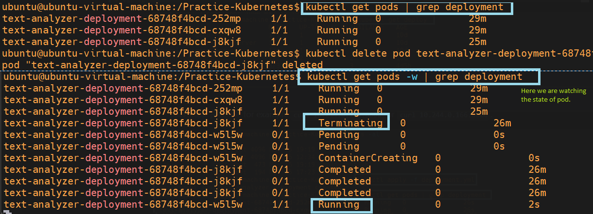
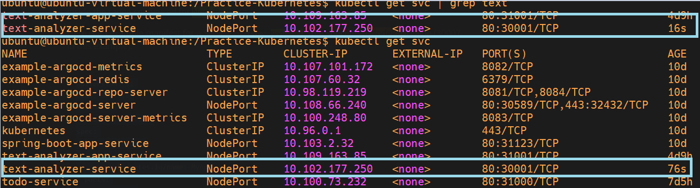

# Deploying Minikube Cluster for Learning Kubernetes

---

## Installation

We have followed the official documentation to install Minikube and the kubectl utility on Ubuntu. The Docker driver is also installed, which Minikube uses behind the scenes.

**References:**
- [Minikube Installation](https://minikube.sigs.k8s.io/docs/start/?arch=%2Flinux%2Fx86-64%2Fstable%2Fbinary+download)
- [Minikube Drivers](https://minikube.sigs.k8s.io/docs/drivers/)
- [Install kubectl](https://kubernetes.io/docs/tasks/tools/install-kubectl-linux/)

---

## Deploying a Pod Using YAML

We followed the [official documentation](https://kubernetes.io/docs/concepts/workloads/pods/) to deploy a pod on the Minikube cluster.

**Steps:**
1. Pulled a Docker image from Docker Hub containing the Python application onto the Ubuntu VM.
2. Edited `pod.yaml`, setting:
    - Pod name and container name to `text-analyzer-practice`
    - Image name to `khannashiv/text-analyzer:46`
3. Applied the YAML:  
   ```sh
   kubectl apply -f pod.yaml
   ```
4. Accessed the pod within Minikube:
    - Used `minikube ssh` to log into the cluster
    - Used `curl <POD_IP>:<APP_PORT>` (e.g., `curl 10.244.0.166:8000`)

**Screenshot:**  
- 

---

## Deploying a Deployment Using YAML

We used the [official documentation](https://kubernetes.io/docs/concepts/workloads/controllers/deployment/) to create a deployment.

**Steps:**
1. Created `deployment.yaml` specifying desired replicas.
2. Applied the YAML:
   ```sh
   kubectl apply -f deployment.yaml
   ```
3. Accessed the pod as before, via `minikube ssh` and curl to the pod IP and port.

**Screenshots:**  
-   
-   
-   
- 

---

## Deploying a Service Using YAML

We followed the [official documentation](https://kubernetes.io/docs/concepts/services-networking/service/) to deploy a service.

**Service Types:**
- **ClusterIP (default):**
    - Internal only (e.g., databases, internal APIs)
- **NodePort:**
    - Exposes the service on a static port on each Node’s IP (port range: 30000–32767)
- **LoadBalancer:**
    - Exposes the service externally (typically for production/public services in the cloud)

**Steps:**
1. Created `service.yaml` with the desired service type (`NodePort` in this case).
2. Applied the YAML:
   ```sh
   kubectl apply -f service.yaml
   ```
3. Accessed the application via the node’s static IP and node port.

**Screenshots:**  
-   
-   
-   
-   
-   
-   
- 

---

## Kubectl Commands Cheat Sheet

- [kubectl Quick Reference](https://kubernetes.io/docs/reference/kubectl/quick-reference/)
- [Kubernetes Cheat Sheet - Spacelift](https://spacelift.io/blog/kubernetes-cheat-sheet)

---

## Deploying Ingress Resource Using YAML

We used the [official documentation](https://kubernetes.io/docs/concepts/services-networking/ingress/) to deploy an ingress resource. An ingress controller (nginx in this case) is required.

**References:**
- [Ingress Concepts](https://kubernetes.io/docs/concepts/services-networking/ingress/)
- [Ingress with Minikube](https://kubernetes.io/docs/tasks/access-application-cluster/ingress-minikube/)
- [Ingress Controllers](https://kubernetes.io/docs/concepts/services-networking/ingress-controllers/)

**Basic Commands:**
```sh
kubectl get deploy -A | grep text
kubectl get svc -A | grep text
kubectl get ingress -A | grep text
kubectl get pods -A | grep nginx
kubectl logs ingress-nginx-controller-56d7c84fd4-cfbc7 -n ingress-nginx
```
> Note: The controller runs as a pod inside the `ingress-nginx` namespace.

**Screenshots:**  
-   
-   
-   
- 

---

### Ingress for Todo Python App

- YAML files are under the `ingress` directory.
- If `host` is set in `ingress-todo.yaml`, update `/etc/hosts` on the VM:
  ```
  <MINIKUBE_IP> <HOSTNAME>
  ```
**Screenshots:**  
-   
-   
-   
-   
-   
- 

---

## Outcomes

### Host-Based Routing

Screenshots:  
-   
-   
-   
-   
-   
-   
-   
-   
-   
-   
-   
- 

---

### Path-Based Routing

Screenshots:  
-   
-   
-   
-   
-   
-   
- 

---

### Wildcard Routing

Screenshots:  
-   
-   
-   
-   
-   
-   
- 