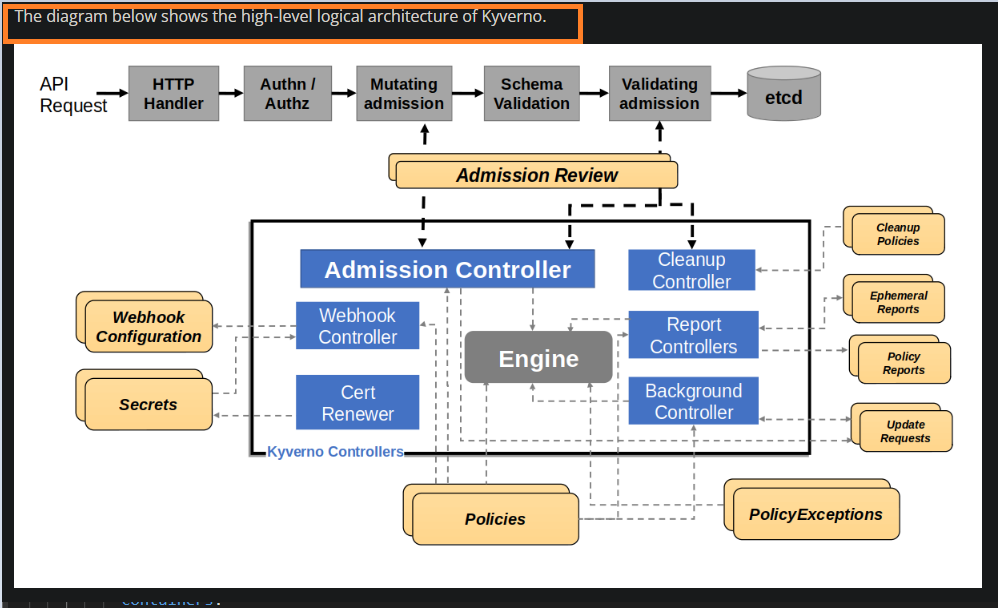

## Kyverno as policy engine for kubernetes cluster.

- Kyverno allows platform engineers to automate security, compliance, and best practices validation and deliver secure self-service to application teams.

**How Kyverno Works?**
- https://kyverno.io/docs/introduction/how-kyverno-works/
- https://kyverno.io/policies/
- https://kyverno.io/docs/exceptions/

**Git repo for Kyverno for doing hands-on**
- https://github.com/kyverno/policies/blob/main/best-practices/
- https://github.com/iam-veeramalla/k8s-kyverno-argocd/tree/main

**Outcomes of sample test policies**

- 